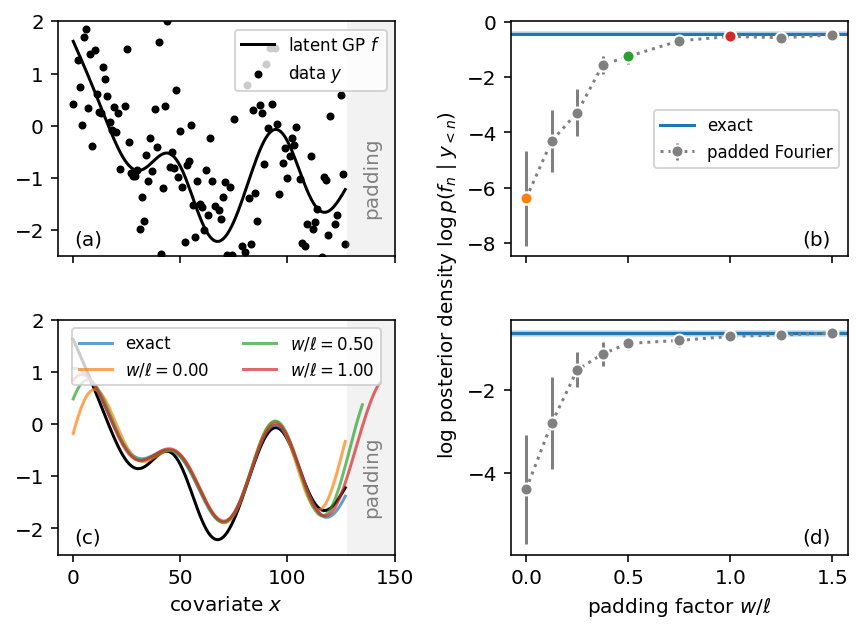
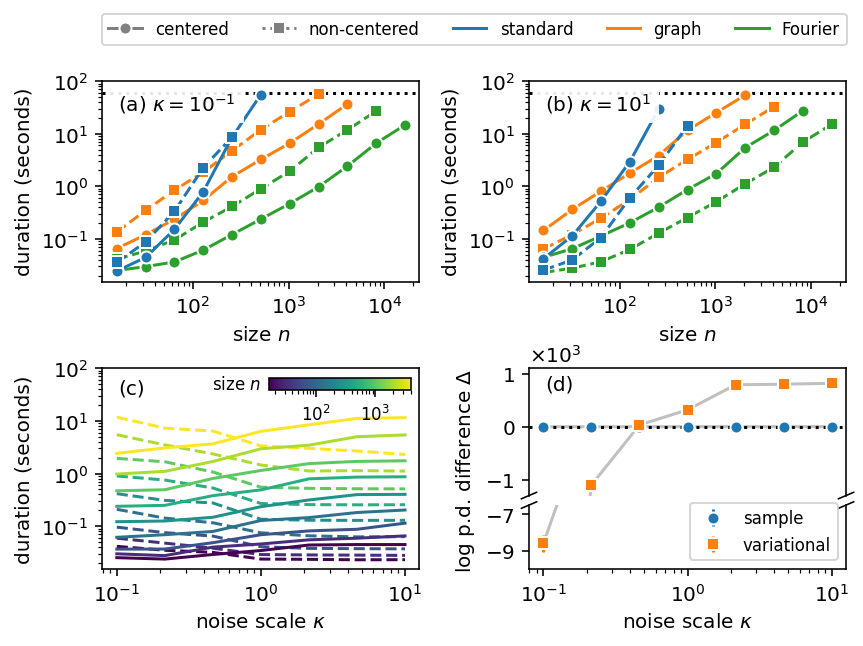

# Reproduction materials for "Scalable Gaussian Process Inference with Stan" 

This repository comprises code and data to reproduce the results and figures in the accompanying manuscript [Scalable Gaussian Process Inference with Stan](https://doi.org/10.48550/arXiv.2301.08836). The source code of the package `gptools-stan` used by these reproduction materials is available [here](https://github.com/onnela-lab/gptools) and can be installed using `pip install gptools-stan`.

## Setting up a computing environment

A computing environment can either be set up directly on your machine by following the [steps below](#direct-installation), or you can reproduce the results in a [Docker container](https://en.wikipedia.org/wiki/Docker_(software)) (see [the following section](#containerized-runtime)).

### Direct installation

1. Ensure a recent version of Python is installed (>= 3.8). The code was tested with Python 3.8, 3.9, 3.10, and 3.11 on Ubuntu (see [here](https://github.com/onnela-lab/gptools/actions/workflows/main.yml) for details) and 3.10 on macOS.
2. Install the Python requirements by running `pip install -r requirements.txt` from the root directory.
3. Install `cmdstan` by running `python -m cmdstanpy.install_cmdstan --verbose --version=2.33.0`. Other versions of `cmdstan` may also work but have not been tested.
4. Verify the installation by running `python -m gptools.stan` which should print `The include path is ...`.

### Containerized runtime

To simplify reproduction, we also provide a `Dockerfile` to build a containerized runtime environment.

1. Ensure Docker is installed. Docker Desktop 4.22.1 (118664) with Docker Engine 24.0.5 was used to test the following steps.
2. Run `docker build -t gptools .` to build the Docker image.
3. Verify the installation by running `./in-docker.sh python -m gptools.stan` which should print `The include path is ...`.

For any of the subsequent commands, they can be executed by either running `[the command]` directly or `./in-docker.sh [the command]` to use the containerized runtime. In the following `[./in-docker.sh]` indicates the optional prefix to run commands in a container.

### Removing compiled Stan programs

If you switch between containerized and local runtime, you may need to remove compiled Stan programs because binaries are not interoperable. Run `[./in-docker.sh] cook exec rm-compiled` to do so.

### Continuous integration

To ensure the reproducibility of these materials, the results are also computed as the output of a GitHub Action workflow  with the `FAST=true` flag. Figures can be obtained by selecting a workflow run and downloading the `figures-reports` artifact.

## Getting started

The `getting_started` folder contains a Python notebook and Rmarkdown file to reproduce the results of the "Getting started" sections in the accompanying manuscript. HTML reports can be generated in the `getting_started` folder by running

- `[./in-docker.sh] cook exec getting_started:run` for Python
- `[./in-docker.sh] cook exec getting_started_R:run` for R

However, the folder is likely most suitable for interactive exploration and experimentation to get familiar with the package.

## Running the experiments

Figures in the manuscript were generated using the containerized runtime, and all runtime estimates below are based on a 2020 Macbook Pro with M1 chip and 16 GB of memory running macOS 13.4 (22F66). All figures can be reproduced by running `[./in-docker.sh] cook exec figures` (see below for details). Figures are generated by executing Jupyter notebooks stored in markdown format; the notebooks can be opened directly in a standard Jupyter environment using the [`jupytext`](https://jupytext.readthedocs.io/en/latest/) extension. If you prefer, the folder for each experiment also contains a corresponding `*.ipynb` file. To open and use the notebooks, please set up a local computing environment as described above.

### Applications

The folders `trees` and `tube` contain code and data to reproduce the two applied examples in the manuscript. Each example takes about five minutes to run. The figures can be reproduced by running `[./in-docker.sh] cook exec tube:run trees:run` and will be saved in the corresponding folder as png and pdf files.

### Profiling experiments

The folder `profile` contains code to reproduce profiling experiments, and running all experiments can take up to ten hours. The profiling figure can be reproduced by running `[./in-docker.sh] cook exec profile:run`. If a reduced runtime (but more noisy results) are desired, run `FAST=true cook exec profile:run` which takes about 90 minutes.

All experiments are seeded for reproducibility, but profiling experiments are subject to variability due to different hardware and competing processes running on the same machine. Despite seeding, results may also vary depending on the operating system and stdlib implementation.

### Kernel properties and effect of padding

The folders `kernels` and `padding` contain code to reproduce figures on the properties of different kernels and their spectral properties as well as the effect of padding on Fourier methods, respectively. The figures can be reproduced by running `[./in-docker.sh] cook exec kernels:run padding:run`; the latter takes about ten minutes to generate.

## Expected results

- `[./in-docker.sh] cook exec kernels:run` 
- `[./in-docker.sh] cook exec padding:run` 
- `[./in-docker.sh] cook exec profile:run` 
- `[./in-docker.sh] cook exec trees:run` 
- `[./in-docker.sh] cook exec tube:run` 
